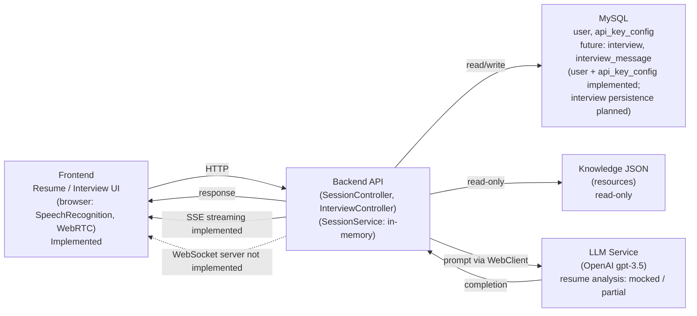

 ## Latency Sources (Current Codebase)

Latency is introduced at the following points in the current codebase:

- **Backend → OpenAI network calls**  
  LLM requests dominate end-to-end latency due to external network round-trip and model inference time.

- **Database reads/writes**  
  Remote MySQL access (e.g., fetching interview/candidate data) adds additional network and query latency.

- **Token length / prompt size**  
  Longer conversation history and higher max-token settings increase OpenAI processing time.

- **Sequential operations**  
  Some DB lookups and LLM calls are executed sequentially, compounding latency.

- **Retries / error handling**  
  Currently limited retry logic; transient failures can introduce additional delay or early termination.

> **Note**  
> SSE streaming is implemented for question generation, reducing perceived latency (time to first token),  
> but total completion time is still dominated by LLM processing.
