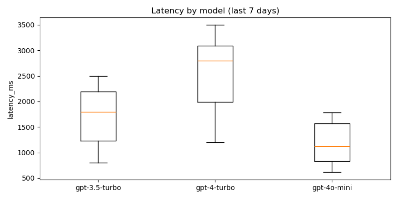
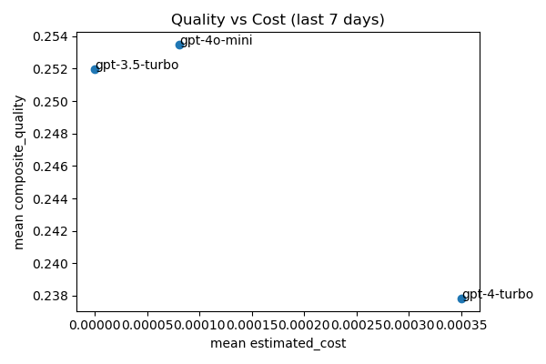

# Weekly ML A/B Report
Generated: 2026-01-24T15:32:43.834154Z

## Per-model latency summary
| model         |   n |   mean_ms |     p50 |     p95 |     p99 | tokens_mean   |   cost_mean |   malformed_rate |   off_topic_rate |   timeout_rate |   tech_depth_avg |   clarity_avg |   relevance_avg |
|:--------------|----:|----------:|--------:|--------:|--------:|:--------------|------------:|-----------------:|-----------------:|---------------:|-----------------:|--------------:|----------------:|
| gpt-3.5-turbo |  90 |   1707.61 | 1793.81 | 2438.31 | 2481.56 |               |   0.2559    |         0.577778 |         0.577778 |              0 |                0 |             0 |             0.3 |
| gpt-4-turbo   |  15 |   2553.27 | 2797.29 | 3410.12 | 3479.87 |               |   5.228     |         0        |         0        |              0 |              nan |           nan |           nan   |
| gpt-4o-mini   |  45 |   1185.45 | 1122.52 | 1747.09 | 1773.01 |               |   0.0253933 |         0        |         0        |              0 |              nan |           nan |           nan   |

## Failure Mode Analysis
| model         |   malformed_rate |   off_topic_rate |   timeout_rate |
|:--------------|-----------------:|-----------------:|---------------:|
| gpt-3.5-turbo |         0.577778 |         0.577778 |              0 |
| gpt-4-turbo   |         0        |         0        |              0 |
| gpt-4o-mini   |         0        |         0        |              0 |

## Interview Quality Metrics
| model         |   tech_depth_avg |   clarity_avg |   relevance_avg |
|:--------------|-----------------:|--------------:|----------------:|
| gpt-3.5-turbo |                0 |             0 |             0.3 |
| gpt-4-turbo   |                0 |             0 |             0   |
| gpt-4o-mini   |                0 |             0 |             0   |

T-test gpt-3.5-turbo vs gpt-4-turbo: n=90,15, p=0.000593, mean_ms=1707.6 vs 2553.3

T-test gpt-3.5-turbo vs gpt-4o-mini: n=90,45, p=1.381e-09, mean_ms=1707.6 vs 1185.4